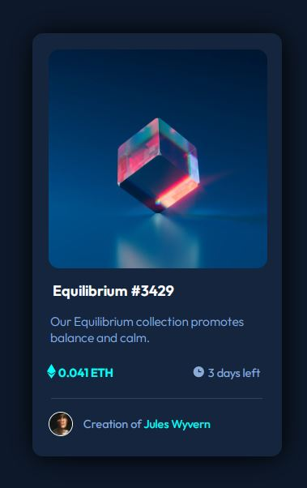

# Frontend Mentor - NFT preview card component solution

This is a solution to the [NFT preview card component challenge on Frontend Mentor](https://www.frontendmentor.io/challenges/nft-preview-card-component-SbdUL_w0U). 

### Screenshot

### Links

- Solution URL: [NFT Preview Card](https://dejair-velozo.github.io/nft-preview-card-component-main/)

### Built with

- Semantic HTML5 markup
- CSS custom properties

### What I learned

I've learned more about Semantic HTML and plain CSS. I will keep practicing so i can improve even more.

## Author

- Frontend Mentor - [@dejair-velozo](https://www.frontendmentor.io/profile/dejair-velozo)

